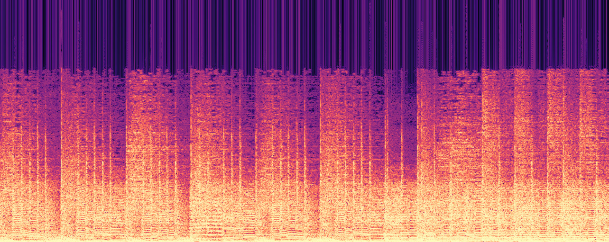
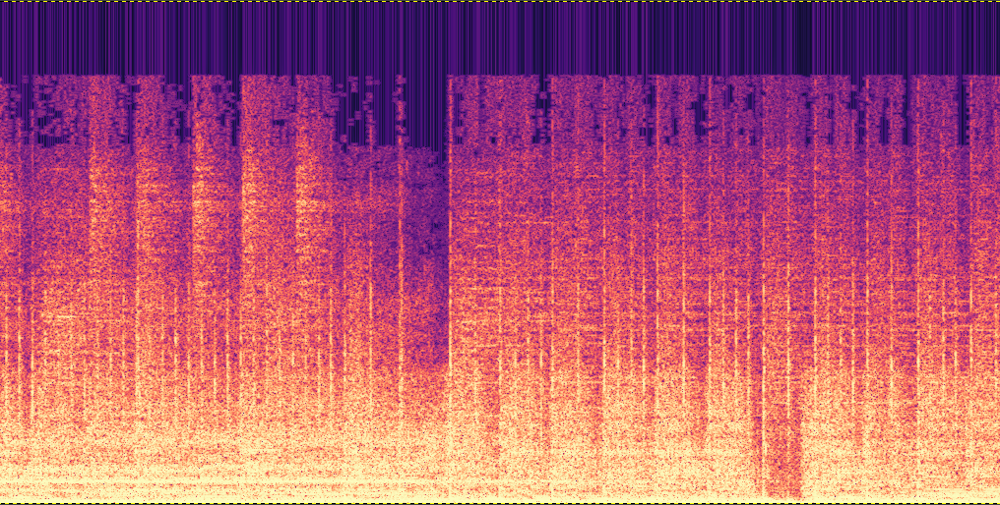
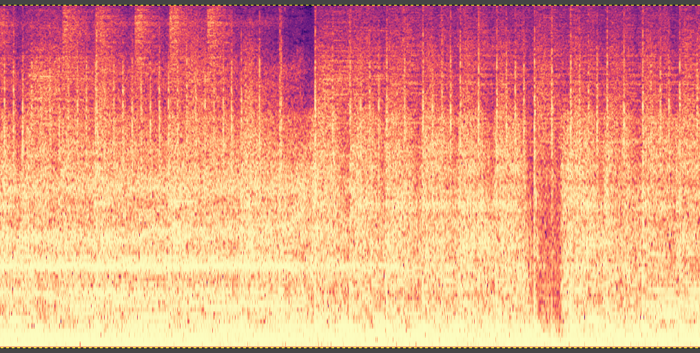

# Spectrogram


**Spectrogram** is a C++ class for creating spectrograms from PCM audio array. Spectrogram uses [Ooura](https://www.kurims.kyoto-u.ac.jp/~ooura/fft.html) FFT that [benchmarks](https://www.fftw.org/benchfft/ffts.html) decently. It also provides [Mel](https://www.mathworks.com/help/audio/ref/melspectrogram.html) image transformation and some standard colormaps. The code is mildly optimized for speed, has a small footprint and can be easily embeeded into an application such as a rhythm game.


## Quickstart

The spectrogram above was generated by the following code


```c++
#include "spectrogram.cpp"
    float *audio; // populate an array of PCM audio samples
    int samples; // number of samples
    auto spec = spectrogram(audio, samples); // initiate class
    spec.normalize_audio(); // ensure audio samples values are [-1..1]
    spec.spectrogram_from_audio(-512, 250, 1024, fft_window::HAMMING);
    spec.spectrogram_histogram_equalization();

    // Resulting grayscale image with float type pixel values [0..1]
    do_something1(spec.image_data, spec.image_lines, spec.image_width);  

    spec.color(COLORMAP_MAGMA, true);
    // Resulting color image with 3 floats (values [0..1]) per pixel
    do_something2(spec.rgb_image_data, spec.image_lines, spec.image_width);
```


## Class Methods

```c++
spectrogram(float *audio_samples_float32, int audio_nsamples)

sets public members:
    float *audio_data;
    int audio_samples;
    float audio_min; // lowest sample value
    float audio_max; // highest
```
Initialize class instance. PCM samples are float. In the future they can be other types using C++ template class.

```c++
normalize_audio(float min=-1, float max=1)

sets public members:
    float audio_min; // lowest sample value
    float audio_max; // highest
```
If the samples have not been normalized, it is a good idea to do so otherwise FFT can result with a big DC value and other artifacts that cause the harmonics in the image less visible

```c++
spectrogram_from_audio(int start, int stride, int fftsize, fft_window::Type window_type)

sets public members:
    float *image_data; // spectrogram data
    int image_lines; // number of fft's
    int image_width; // frequencies per fft (half of fftsize)
```
FFT of size `fftsize` (a.k.a window, must be power of 2) is computed starting every `stride` samples. The first FFT window can start before the first sample if `start` is negative resulting in zero padded sample window. The last FFT window will have to include at least one sample. If a sample window ends beyond available samples, it will be zero padded. The resulting number of FFT lines in the image is `(samples-start+stride-1)/stride`. The samples are multiplied by a filter window before being processed by FFT. Several popular [filters](https://en.wikipedia.org/wiki/Window_function) can be set with `window_type` including Hanning and Hamming. See [filterwindow.cpp](filterwindow.cpp). The result of FFT (DFT) is an array of complex values (r,i) of size fftsize/2 frequencies. The image pixels are computed as `log(hypot(r,i))` and later normalized so that the range of values are between [0..1]. 

```c++
spectrogram_histogram_equalization()

sets public members:
    float *image_data; // spectrogram data
```
Histogram equalization using cumulative frequency. The function uses 65536 buckets (16 bit maxint). The result is a clearer image especially for noisy sound signal.

```c++
mel_spectrogram(int MELSIZE, int SAMPLE_RATE, float MIN_FREQ, float MAX_FREQ, float MEL_700, float MEL_2595)

sets public members:
    float *mel_image_data; // Mel's distorted spectrogram image
    int mel_image_width = 0; // number of fft frequencies "bins"
```

FFT spectrogram shows linear frequency scale. The human ear can differentiate frequency shifts better at lower frequencies than at higher ones. [Mel Scale](https://en.wikipedia.org/wiki/Mel_scale) is an image transformation so that lower frequencies take a large portion of the image, and higher frequencies are condensed to smaller number of pixels toward the top of the image. The implementation refers to the original notation `MEL_700` of frequency ranges to be spread over 50% of the image height. Frequencies under `MIN_FREQ` and over `MAX_FREQ` will no be visible. Due to normalization of log values, the `MEL_2595` value has no effect. (Todo: This image distortion function should be generalized into a spline curve rather than the logarithmic curve and without the need naming frequencies or `SAMPLE_RATE`)

```c++
color(COLORMAPS_t colormap, bool fft_or_mel)

sets public members:
    float *rgb_image_data; // colored fft or mel image;
    bool rgb_image_fft_or_mel;
```
Map gray scale image values to colors. Creates a color representation of the image using popular color palettes such as [Viridis](https://docs.opencv.org/5.x/d3/d50/group__imgproc__colormap.html). See [colormaps.h](colormaps.h). The coloring can apply either to the FFT image or the MEL image that are kept in individual buffers but the resulting RGB image is overritten if this function is called more than once.


## Example program

An example program [test_ffmpeg.cpp](test_ffmpeg.cpp) is included in this repository which demonstrates how to use the class. It invokes [ffmpeg](https://www.ffmpeg.org/) to convert an audio file in any format into PCM floating points. It also uses ffmpeg to create 3 images from the input audio: fft, fft_color, mel_color and prints the time it took to run each stage.

Here are steps to test the code and reproduce the images below:

```bash
# install youtube downloader (Ubuntu: sudo apt install yt-dlp)
# install latest ffmpeg (Ubuntu: sudo snap install ffmpeg --edge)
# download a sample song for educational purpose
mkdir ~/test_spectrogram
cd ~/test_spectrogram
yt-dlp -x -f251 -o "guitar.%(ext)s" https://www.youtube.com/watch?v=pCEjgl2I4z4 --exec 'ffmpeg -i {} -acodec vorbis -strict -2 guitar.ogg'
# download this repo:
git clone https://github.com/limor666/spectrogram-lib
cd spectrogram-lib
# compile the demo program and fft designed for SIMD optimization
g++ -O6  test_ffmpeg.cpp OouraFFT/fftsg.c -lm
# run the program
# first param: input music file
# second param: name prefix and type of image format 
./a.out ../guitar.ogg asdf.png
# This will create 3 image files
# fft_asdf.png - colored spectrogram
# fftg_asdf.png - gray spectrogram
# mel_asdf.png - mel spectrogram
# view the images using gimp. The images will be rotated 90º clockwise.
gimp *asdf.png
```

Spectrogram of metal music genre, with stride of 250 samples, FFT window of 1024, Hamming filter. The track was downloaded from youtube and resampled to 44100Hz but the signal seems to have a cutoff frequency of around 18kHz. [Todo: contrast should be a parameter] 



Same spectrogram colored with Magma colormap palette



Mel image transformation whereby only frequencies 30Hz to 15kHz are visible. The bottom half of the image shows frequencies up to around 1khz linearly. The upper half shows the rest of the frequencies squashed on a log scale. The image height is 500 pixels not 512 as in the images above. 


