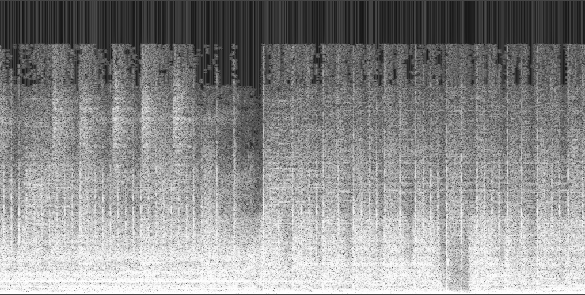

# Spectrogram


**Spectrogram** is a C++ class for creating spectrograms from PCM audio array. Spectrogram uses [Ooura](https://www.kurims.kyoto-u.ac.jp/~ooura/fft.html) FFT that [benchmarks](https://www.fftw.org/benchfft/ffts.html) decently. It also provides [Mel](https://www.mathworks.com/help/audio/ref/melspectrogram.html) image transformation and some standard colormaps. The code is mildly optimized for speed.


## Quickstart

* The spectrogram above was generated by the following code


```c++
#include "spectrogram.cpp"
    float *audio; // populate an array of PCM audio samples
    int samples; // number of samples
    auto spec = spectrogram(audio, samples); // initiate class
    spec.normalize_audio(); // ensure audio samples values are [-1..1]
    spec.spectrogram_from_audio(-512, 250, 1024, fft_window::HAMMING);
    spec.spectrogram_histogram_equalization();

    // Resulting grayscale image with float type pixel values [0..1]
    do_something1(spec.image_data, spec.image_lines, spec.image_width);  

    spec.color(COLORMAP_MAGMA, true);
    // Resulting color image with 3 floats (values [0..1]) per pixel
    do_something2(spec.rgb_image_data, spec.image_lines, spec.image_width);
```


## Class Methods

```c++
spectrogram(float *audio_samples_float32, int audio_nsamples)

sets public members:
    float *audio_data;
    int audio_samples;
    float audio_min; // lowest sample value
    float audio_max; // highest
```
Initialize class instance. PCM samples are float. In the future they can be other types using C++ template class.

```c++
normalize_audio(float min=-1, float max=1)

sets public members:
    float audio_min; // lowest sample value
    float audio_max; // highest
```
If the samples have not been normalized, it is a good idea to do so otherwise FFT can result with a big DC value and other artifacts that cause the harmonics in the image less visible

```c++
spectrogram_from_audio(int start, int stride, int fftsize, fft_window::Type window_type)

sets public members:
    float *image_data; // spectrogram data
    int image_lines; // number of fft's
    int image_width; // frequencies per fft (half of fftsize)
```
FFT of size `fftsize` (a.k.a window, must be power of 2) is computed starting every `stride` samples. The first FFT window can start before the first sample if start is negative resulting in zero padded sample window. The last FFT window will have to include at least one sample. If a sample window ends beyond available samples, it will be zero padded. The resulting number of FFT lines in the image is (samples-start+stride-1)/stride. The samples are multiplied by a filter window before being processed by FFT. Several popular [filters](https://en.wikipedia.org/wiki/Window_function) are available including Hanning and Hamming. See [filterwindow.cpp](filterwindow.cpp)

```c++
spectrogram_histogram_equalization()

sets public members:
    float *image_data; // spectrogram data
```
Histogram equalization using cumulative frequency. The result is a clearer image especially for noisy sound signal.

```c++
mel_spectrogram(int MELSIZE, int SAMPLE_RATE, float MIN_FREQ, float MAX_FREQ, float MEL_700, float MEL_2595)

sets public members:
    float *mel_image_data; // mel's disted spectrogram image
    int mel_image_width = 0; // number of fft frequencies "bins"
```

FFT spectrogram shows linear frequency scale. The human ear can differentiate frequency shifts better at lower frequencies than at higher ones. [Mel Scale](https://en.wikipedia.org/wiki/Mel_scale) is an image transformation so that lower frequencies take a large portion of the image, and higher frequencies are condensed smaller number of pixels toward the top of the image. The implementation follows the original notation of frequency range to take 50% of the image heigh. Due to normalization of resulting values, the MEL_2595 value has no effect. (This image magnification function should be generalized into a spline curve rather than the logarithmic curve and without the need for sample rate)

```c++
color(COLORMAPS_t colormap, bool fft_or_mel)

sets public members:
    float *rgb_image_data; // colored fft or mel image;
    bool rgb_image_fft_or_mel;
```
Creates a color representation of the image using popular color palletes such as [Viridis](https://docs.opencv.org/5.x/d3/d50/group__imgproc__colormap.html). See [colormaps.h](colormaps.h)


## Example program

An example program [test_ffmpeg.cpp](test_ffmpeg.cpp) is included in this repository which demonstrates how to use the class. It invokes [ffmpeg](https://www.ffmpeg.org/) to convert an audio file in any format into PCM floating points. It also uses ffmpeg to create 3 images from the input audio: fft, fft_color, mel_color and prints the time it took to run each stage.





NAudio to get samples from the sound card and display them as a spectrogram. Spectrogram was designed to be able to display spectrograms with live or growing data, so this is exceptionally easy to implement.
